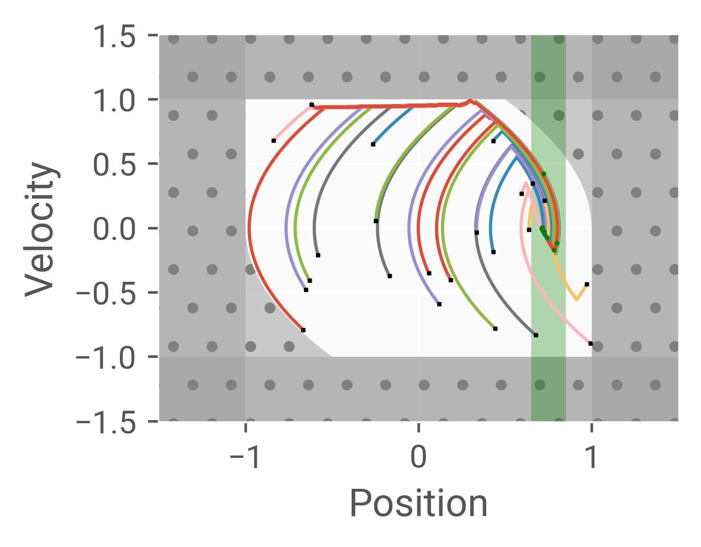

<div align="center">

# Epigraphic Form Proximal Policy Optimization (EFPPO)

</div>

<p align="center">
    
    
    &ensp;
    
    
</p>

<div align="center">

### Solving Stabilize-Avoid Optimal Control via Epigraph Form and Deep Reinforcement Learning
[Oswin So](oswinso.xyz), [Chuchu Fan](https://chuchu.mit.edu)

[Webpage](https://mit-realm.github.io/efppo/) •
[arXiv](https://arxiv.org/abs/2305.14154) •
[Paper](https://arxiv.org/pdf/2305.14154.pdf) &ensp; ❘ &ensp;
[Installation](#installation) •
[Getting started](#getting-started) •
[Citation](#citation)

</div>

## Installation
This is a [JAX](https://github.com/google/jax)-based project. To install, install `jax` first and other prereqs following their [instructions](https://jax.readthedocs.io/en/latest/installation.html).
Next, clone the repository and install the package.
```bash
git clone https://github.com/mit-realm/efppo.git
cd efppo
pip install -e .
```

## Getting started
Example:
```bash
python python scripts/train_dbint_inner.py --name run1
python scripts/eval_dbint_rootfind.py runs/DbInt_inner/00001-run1/ckpts/00099999/default
```

<div align="center">
    
</div>

## Citation
Please cite the [EFPPO paper](https://arxiv.org/abs/2305.14154).
```bibtex
@inproceedings{so2023solving, 
    AUTHOR    = {Oswin So AND Chuchu Fan}, 
    TITLE     = {{Solving Stabilize-Avoid Optimal Control via Epigraph Form and Deep Reinforcement Learning}}, 
    BOOKTITLE = {Proceedings of Robotics: Science and Systems}, 
    YEAR      = {2023}, 
    MONTH     = {July},  
    DOI       = {10.15607/RSS.2023.XIX.085}  
} 
```